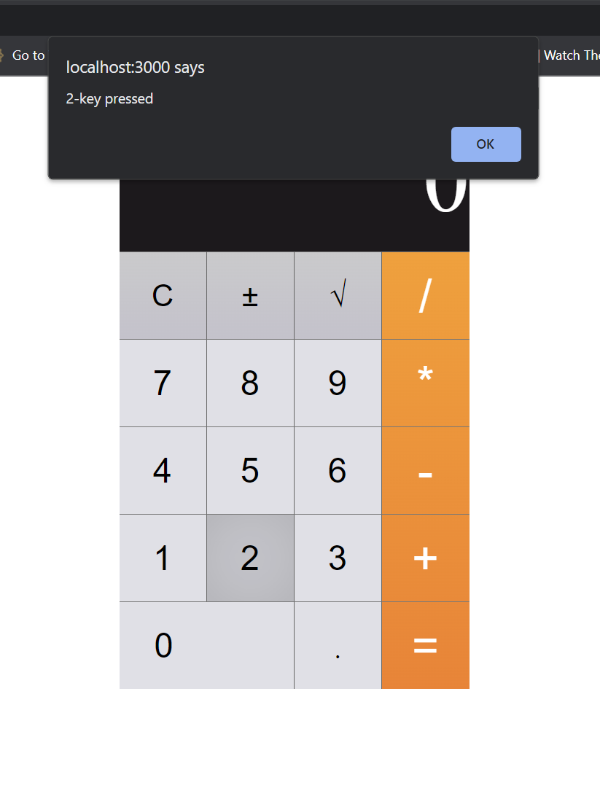

# Week 6 React Activity

In the previous weeks, we built a small Calculator using TDD.
Now that we have mastered the skill of TDD, we will not use it in this activity :p.
We will, however, use the calculator that we built previously.
In this activity, we will build a UI using React for our calculator.

Students are expected to work in pairs on this activity.
Submission instructions are at the bottom of the document (tldr; run `npm run zip` and upload `submission.zip` to gradescope).

_Note 1_: There are some keys in the UI which were not in the previous activity. It is fine if they don't work.

_Note 2_: We recommend completing the activity with the provided CalculatorModel. As the last step, you can replace it with your own calculator model.
The react linter/webpack will probably complain about your implementation and you may need to make some changes before the app works again.

## Key Ideas

This activity gives an overview of 3 simple but important concepts of react:

- State
- Props
- Using them together to update state shared by different components.

## Starter Code Overview

To save some time and effort, we have already provided the HTML and CSS for a calculator.
The stater code contains a scaffold of a react application created using `create-react-app`.
The src contains a lot of files and folders which might seem a bit overwhelming, but we are actually concerned with very few files.
We are already familiar with most of these files (`src/enums`, `src/interfaces`, `src/models`).
They are the calculator we implemented in the past weeks.
What are the new files? We only care about 3 files:

- `src/calculator.tsx`: Root component for our calculator.
- `src/components/display/calculator-display.tsx`: The display section of the calculator.
- `src/components/key/calculator-key.tsx`: The key component for the calculator keypad.

There are some other supporting files like CSS for the components, some spec files, and some config files.
But these are less interesting to us at this point.

### Making sure the starter code works

In the root of the project (where the package.json exists), run `npm install`.
Then run `npm start`.

This should start a local dev server at http://localhost:3000, and open the React application in a browser.
The UI should look as shown below.
Additionally, if you press on any key, an alert should pop up as shown.



If this does not work, ask the staff for assistance.

## Getting started

As we mentioned earlier, we only care about 3 files:

- `src/calculator.tsx`: Root component for our calculator.
- `src/components/display/calculator-display.tsx`: The display section of the calculator.
- `src/components/key/calculator-key.tsx`: The key component for the calculator keypad.

### Calculator Component

`src/calculator.tsx` defines the Calculator component.
The Calculator component is the top level component which is composed of 2 parts: a display and a keypad.
This is implemented using 2 child components: `CalculatorDisplay` and `CalculatorKey`.
The calculator uses several key components and organizes them into a Keypad.

The body of the Calculator component is as shown below:

```tsx
export default function Calculator() {
  return (
    <div className="container">
      <div className="calculator">
        <CalculatorDisplay />

        <div className="calculator-keypad">
          <div className="input-keys">
            <div className="function-keys">
              <CalculatorKey className="key-clear" label={ActionKeys.CLEAR} />
              <CalculatorKey
                className="key-sign"
                label={ActionKeys.SIGN_FLIP}
              />
              <CalculatorKey
                className="key-percent"
                label={OperatorKeys.SQRT}
              />
            </div>
            <div className="digit-keys">
              <CalculatorKey className="key-0" label={NumericKeys.ZERO} />
              <CalculatorKey className="key-dot" label={ActionKeys.DOT} />
              <CalculatorKey className="key-1" label={NumericKeys.ONE} />
              <CalculatorKey className="key-2" label={NumericKeys.TWO} />
              <CalculatorKey className="key-3" label={NumericKeys.THREE} />
              <CalculatorKey className="key-4" label={NumericKeys.FOUR} />
              <CalculatorKey className="key-5" label={NumericKeys.FIVE} />
              <CalculatorKey className="key-6" label={NumericKeys.SIX} />
              <CalculatorKey className="key-7" label={NumericKeys.SEVEN} />
              <CalculatorKey className="key-8" label={NumericKeys.EIGHT} />
              <CalculatorKey className="key-9" label={NumericKeys.NINE} />
            </div>
          </div>
          <div className="operator-keys">
            <CalculatorKey className="key-divide" label={OperatorKeys.DIV} />
            <CalculatorKey className="key-multiply" label={OperatorKeys.MULT} />
            <CalculatorKey
              className="key-subtract"
              label={OperatorKeys.MINUS}
            />
            <CalculatorKey className="key-add" label={OperatorKeys.PLUS} />
            <CalculatorKey className="key-equals" label={ActionKeys.EQUALS} />
          </div>
        </div>
      </div>
    </div>
  );
}
```

### Display Component

`src/components/display/calculator-display.tsx` defines the Display component.
This is a very simple component which is expected to show the updated value of the component on every key press.
By default, it only shows 0.

The body of the display component is as shown below:

```tsx
export function CalculatorDisplay(arg: any) {
  return <div className="calculator-display">0</div>;
}
```

### Key Component

`src/components/key/calculator-key.tsx` defines the Key component.
This is also a very simple component which is expect to update the value (through the calculatorModel) on the display every time it is clicked.
There are some things in this component which can be a bit tricky for beginners:

- Every instance of the Key component has a different value.
- Thus different instances of the same component must update the display with a different value.
- An event on the Key component is expected to update the value on a differnt component.

React makes all this very easy.

The body of the Key component is as shown below:

```tsx
export function CalculatorKey(arg: any) {
  return (
    <button
      className={`calculator-key ${arg.className}`}
      onClick={() => alert(`${arg.label}-key pressed`)}
    >
      {arg.label}
    </button>
  );
}
```

## Wiring Up The Display

Before we start making changes to the code, there are 2 key concepts we need to understand:

- _State_: The state of a react component is the mutable data associated with a component. An update to the state triggers change detection, which updates the UI. In other words, if you want to update the UI, you update the state.
- _Props_: Props are properties (data and methods) that are provided to a child component by the parent component. There are 2 key aspects from props:
  - Any updates to the props triggers change detection on the child component and update its UI.
  - Methods (state setters) passed through props can be used to update the state on a parent component, thereby propagating changes to sibblings.

_IMPORTANT RULE_: If there is data shared between different components, always define it at the top level (or a common parent component for all users).

Now that we know what state and props are, let us see how to use them in our calculator.
Let us start with the Display component (`src/components/display/calculator-display.tsx`).

We know the display component has a state (current value of the calculator), but we also know that this state will be updated by a sibbling (key) component.
Thus, following the rule stated above, we must define the state on a parent to both, which in this case is the Calculator component.
Now, since the state is on the parent, the Display component must recieve it as a _prop_.

It is generally a good idea to define an interface for the props on a child component so that all parents know the values to pass in.

Let us add the below interface to the display component as shown:

```tsx
interface IProps {
  displayValue: string;
}

export function CalculatorDisplay(props: IProps) {
  return <div className="calculator-display">0</div>;
}
```

_Note_: if you have `npm start` running, it will show some errors. These will go away as you follow the steps below and complete the implementation.

Now to use the display value, we can simply wrap the value on `{}` in tsx as below:

```tsx
interface IProps {
  displayValue: string;
}

export function CalculatorDisplay(props: IProps) {
  return <div className="calculator-display">{props.displayValue}</div>;
}
```

Now our component accepts a string from the parent component and displays it.
However, our parent component isn't actually passing in any value. Let us fix that.

We will make an additional small change to the display component.
If the value of `props.displayValue` is ever an empty string, the display component will disappear.
To avoid this, we will modify the code as below to default to `0`:

```tsx
export function CalculatorDisplay(props: IProps) {
  const value = props.displayValue || "0";
  return <div className="calculator-display">{value}</div>;
}
```

Go to `src/calculator.tsx`
and pass a static value '0' to the display component as shown below:

```tsx
export default function Calculator() {

  return (
    <div className='container'>
      <div className="calculator">


        <CalculatorDisplay displayValue='0' />

        ...
```

The previous errors should go away and the app should work just as before.

Now, let us make this a bit more dynamic and add some State to the Calculator component.

Create a state variable as shown below:

```tsx
export default function Calculator() {

  const [display, setDisplay] = useState('0');

  return (
    <div className='container'>
      <div className="calculator">

      ...
```

_Note_: Add an import for `useState` at the top.

This creates a new State variable called `display` with a setter function called `setDisplay` and a default value of '0'.

_IMPORTANT NOTE_: State updates must only be made through the setter function for change detection to work.

Now let us pass the state variable `display` to our display component as below (note the {} instead of ''):

```tsx
const [display, setDisplay] = useState('0');

  return (
    <div className='container'>
      <div className="calculator">


        <CalculatorDisplay displayValue={display} />

        ...
```

This concludes the wiring of our display component.
Next let us update the display value when a key is pressed.

## Wiring Up The Keys

Wiring up the Keys is very similar to the display.
The only differene is that we have more props, and we will actually invoke some methods from the props.

Let us start with the Key component (`src/components/key/calculator-key.tsx`).
Similar to the Display component, let us define an interface for the props.
Here, we have 3 things we care about: key label, class name, and the method to invoke when the key is pressed.

Let us define an interface as below:

```tsx
interface IProps {
  onPress(key: NumericKeys | OperatorKeys | ActionKeys): void;
  label: NumericKeys | OperatorKeys | ActionKeys;
  className: string;
}

export function CalculatorKey(props: IProps) {
  return (
    <button
      className={`calculator-key ${props.className}`}
      onClick={() => alert(`${props.label}-key pressed`)}
    >
      {props.label}
    </button>
  );
}
```

_Note_: Add any missing imports.

Let us update the `onClick` event handler to invoke the function passed in through the props.
Make the changes as below:

```tsx
interface IProps {
  onPress(key: NumericKeys | OperatorKeys | ActionKeys): void;
  label: NumericKeys | OperatorKeys | ActionKeys;
  className: string;
}

export function CalculatorKey(props: IProps) {
  return (
    <button
      className={`calculator-key ${props.className}`}
      onClick={() => props.onPress(props.label)}
    >
      {props.label}
    </button>
  );
}
```

Similar to last time, webpack will complain about the missing props in our Calculator component.
Let us pass in a dummy function temporarily to all Key components to get rid of the errors.
Go to the Calculator component and add the method below:

```tsx
  const [display, setDisplay] = useState('0');

  function dummy(key: NumericKeys | OperatorKeys | ActionKeys): void {
    alert(`${key}-key pressed.`);
  }

  ...
```

Update all key components and pass in the dummy function as a prop called `onpress` as shown below:

```tsx
export default function Calculator() {
  const [display, setDisplay] = useState("0");

  function dummy(key: NumericKeys | OperatorKeys | ActionKeys): void {
    alert(`${key}-key pressed.`);
  }

  return (
    <div className="container">
      <div className="calculator">
        <CalculatorDisplay displayValue={display} />

        <div className="calculator-keypad">
          <div className="input-keys">
            <div className="function-keys">
              <CalculatorKey
                className="key-clear"
                label={ActionKeys.CLEAR}
                onPress={dummy}
              />
              <CalculatorKey
                className="key-sign"
                label={ActionKeys.SIGN_FLIP}
                onPress={dummy}
              />
              <CalculatorKey
                className="key-percent"
                label={OperatorKeys.SQRT}
                onPress={dummy}
              />
            </div>
            <div className="digit-keys">
              <CalculatorKey
                className="key-0"
                label={NumericKeys.ZERO}
                onPress={dummy}
              />
              <CalculatorKey
                className="key-dot"
                label={ActionKeys.DOT}
                onPress={dummy}
              />
              <CalculatorKey
                className="key-1"
                label={NumericKeys.ONE}
                onPress={dummy}
              />
              <CalculatorKey
                className="key-2"
                label={NumericKeys.TWO}
                onPress={dummy}
              />
              <CalculatorKey
                className="key-3"
                label={NumericKeys.THREE}
                onPress={dummy}
              />
              <CalculatorKey
                className="key-4"
                label={NumericKeys.FOUR}
                onPress={dummy}
              />
              <CalculatorKey
                className="key-5"
                label={NumericKeys.FIVE}
                onPress={dummy}
              />
              <CalculatorKey
                className="key-6"
                label={NumericKeys.SIX}
                onPress={dummy}
              />
              <CalculatorKey
                className="key-7"
                label={NumericKeys.SEVEN}
                onPress={dummy}
              />
              <CalculatorKey
                className="key-8"
                label={NumericKeys.EIGHT}
                onPress={dummy}
              />
              <CalculatorKey
                className="key-9"
                label={NumericKeys.NINE}
                onPress={dummy}
              />
            </div>
          </div>
          <div className="operator-keys">
            <CalculatorKey
              className="key-divide"
              label={OperatorKeys.DIV}
              onPress={dummy}
            />
            <CalculatorKey
              className="key-multiply"
              label={OperatorKeys.MULT}
              onPress={dummy}
            />
            <CalculatorKey
              className="key-subtract"
              label={OperatorKeys.MINUS}
              onPress={dummy}
            />
            <CalculatorKey
              className="key-add"
              label={OperatorKeys.PLUS}
              onPress={dummy}
            />
            <CalculatorKey
              className="key-equals"
              label={ActionKeys.EQUALS}
              onPress={dummy}
            />
          </div>
        </div>
      </div>
    </div>
  );
}
```

The errors should now go away and the code should work as before.

### Updating the state

Now let us implement the logic that updates the display when a key is pressed.
All changes are in the Calculator component.

Create a new method called `numericKeyPressHandler`, similar to the `dummy` method.
Instead of invoking the `alert` function, invoke `setDisplay(key)`.

The code should now look as below:

```tsx
export default function Calculator() {

  const [display, setDisplay] = useState('0');

  function numericKeyPressHandler(key: NumericKeys): void {
    setDisplay(key);
  }

  function dummy(key: NumericKeys | OperatorKeys | ActionKeys): void {
    alert(`${key}-key pressed.`);
  }

  return (
    <div className='container'>
      <div className="calculator">

      ...
```

Now, update the `onPress` prop for numeric keys to pass in the new handler (`numericKeyPressHandler`) instead of `dummy`.
For example, the `1` key component should now look as below:

```tsx
<CalculatorKey
  className="key-1"
  label={NumericKeys.ONE}
  onPress={numericKeyPressHandler}
/>
```

Similarly update all the other numberic keys.

Now, if you click on the `1` key, the display value should change to `1`.

### Next Steps

Similarly implement a `operatorKeyPressHandler(key: OperatorKeys)` and `actionKeyPressHandler(key: ActionKeys)` and update the Key components in the Calculator component accordingly.

## Bringing in the Calculator Model

We are almost done with wiring up the Calculator.
The last step is very easy.

In the calculator component, import the calculator model.
Create an instance of the Calculator model just above the body for the Calculator Component.

_IMPORTANT_: It is important that the instance of the model is created outside the Calculator function.

The code should look as below:

```tsx
import { ICalculatorModel } from './interfaces/calculator-model.interface';
import { CalculatorModel } from './models/calculator.model';

const calculatorModel: ICalculatorModel = new CalculatorModel();

export default function Calculator() {

  const [display, setDisplay] = useState('0');

  function numericKeyPressHandler(key: NumericKeys): void {
    setDisplay(key);
  }

  ...
```

Next, let us replace the default value for the state with the default display value for the calculator model.

```tsx
const [display, setDisplay] = useState(calculatorModel.display());
```

Finally, we need to update the keyPress handlers to invoke the appropriate methods on the calculatorModel and invoke setDisplay with the updated value of the calculatorModel.

The code below shows the updated `numericKeyPressHandler()` method:

```tsx
function numericKeyPressHandler(key: NumericKeys): void {
  calculatorModel.pressNumericKey(key);
  setDisplay(calculatorModel.display());
}
```

Similarly update the other handlers with appropriate code and the Calculator should work as expected!

## Final Step

- Replace the given calculator model with your own.
- Fix any error React might throw.

## Submission

In the root directory, run the command `npm run zip`.
This command will generate a zip file called `submission.zip`.
Upload the `submission.zip` file to Gradescope and tag your partner on Gradescope on the submission.
